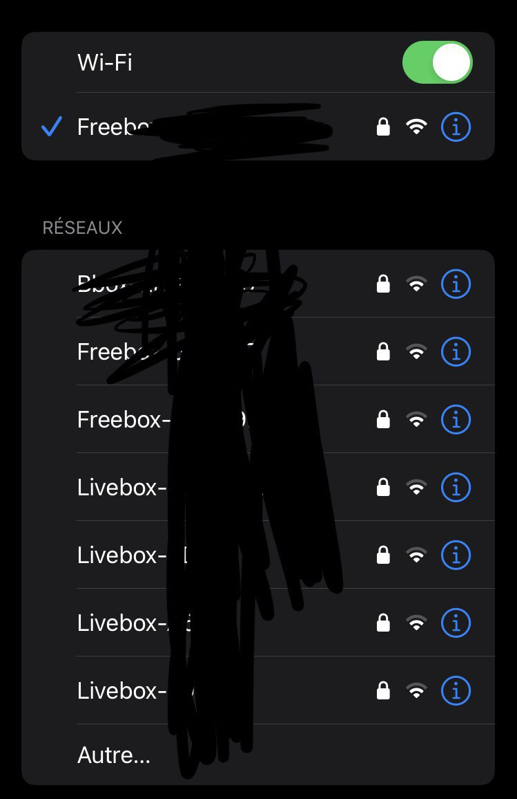
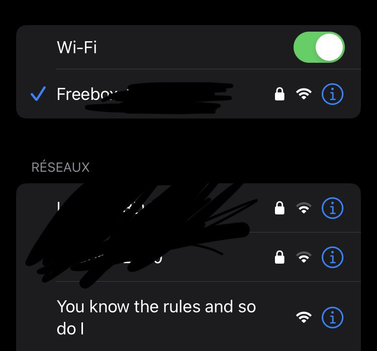

#  Epsilon ESP32 SCANNER  

Epsilon is a tool for monitoring the surrounding WiFi and Bluetooth Low Energy (BLE) networks, designed for troubleshooting, network management, and research applications. It also includes a fun "rickroll" action to display information about detected WiFi networks, including the total number of networks found.

## Features

- **WiFi Network Scanning:** Epsilon uses the "WiFi.h" library to scan and display information about nearby WiFi networks, including:
    - The total number of networks found.
    - Network name (SSID).
    - Signal strength (RSSI).
    - WiFi channel.
    - Access Point MAC address (BSSID).
    - Encryption type (EncType).

- **Deauther (Under Development):** Epsilon currently includes a "Deauther" feature that can be used to send deauthentication packets to devices connected to a WiFi network. This feature is still under active development and has not been tested yet. Please note that its functionality is not guaranteed at this stage.

- **Rickroll:** Epsilon can be used to perform a "rickroll" by displaying information about WiFi networks in a humorous and entertaining way.

   

# Library Installation

To run this project, you need to install some Arduino libraries. Here's how to do it:

1. **Arduino IDE:** Make sure you have the Arduino IDE installed on your computer. If it's not already installed, download and install the IDE from the official Arduino website: [Download Arduino IDE](https://www.arduino.cc/en/software).

2. **Library Installation:** Once the Arduino IDE is installed, open it and follow these steps to install the required libraries:

   - **esp_wifi:** This library is usually included with the Arduino IDE when configuring the ESP32 board. Ensure that your Arduino environment is set up correctly for the ESP32 board. If not, follow the specific instructions for your ESP32 board to configure the Arduino IDE.

   - **WiFi:** This library is also typically included with the Arduino IDE. No additional installation is needed.

   - **NimBLE:** This is the Bluetooth library used in your project. To install it, follow these steps:
     - Open the Arduino IDE.
     - Click on "Sketch" in the menu bar, then select "Include Library" > "Manage Libraries..."
     - In the search box, type "NimBLE."
     - Select the "NimBLE" library from the list and click the "Install" button to install it.

3. **Board Configuration:** Ensure that your project is correctly configured for the ESP32 board in the Arduino IDE. You'll need to select the "ESP32" board in the "Tools" > "Board" menu.

After following these steps, your Arduino libraries will be installed and ready to use in your project. You can now download the code and start working on your application.

Please remember to adapt these instructions based on your specific needs and provide additional details if necessary, including links to relevant online resources.

## Usage

1. Ensure that you have correctly set up your Arduino development environment.

2. Load the Epsilon source code onto your compatible device.

3. Implement the desired action function.

## Disclaimer

The use of this tool should comply with local regulations and ethical standards. It is essential not to use this tool for illegal, intrusive, or malicious purposes. Always ensure that you have the appropriate permissions before scanning or interacting with WiFi networks.

## Author

The Epsilon Project was developed by Eunous.

---

*We remind you to always respect the privacy of others and adhere to the applicable laws when using this tool. The project author and contributors are not responsible for any improper use of this tool.*
